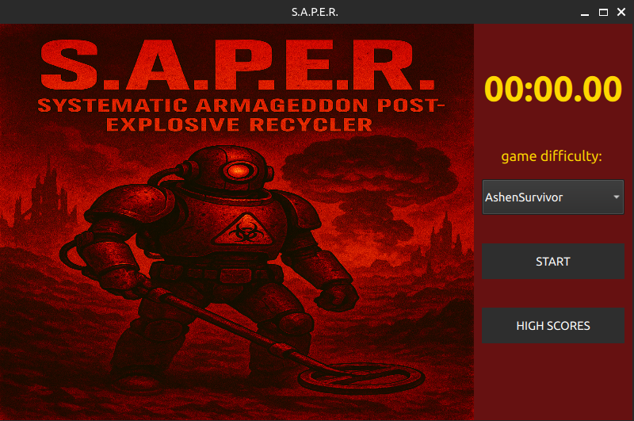
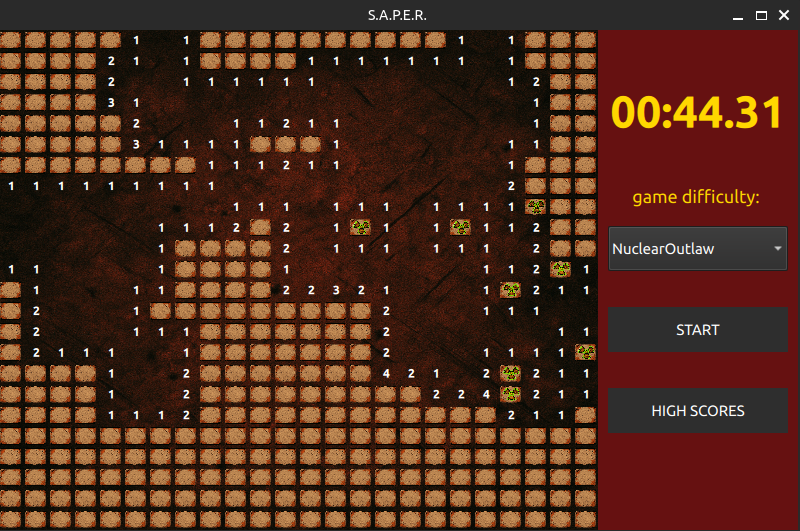

# Retro Saper (Qt / QML)

A classic **Minesweeper-style game** implemented in **C++ (Qt) + QML**, with a clean MVC-inspired architecture, difficulty levels, timer, and persistent high scores.

---

## 🎮 Game Rules

The goal is to **reveal all non-mine cells** on the board without detonating a mine.

- The board consists of a grid with hidden mines
- Clicking a cell:
  - Reveals a number indicating nearby mines, or
  - Reveals empty areas recursively if no mines are adjacent
- You can **flag cells** you suspect contain mines
- The **first move is always safe**
- The game ends when:
  - 💥 A mine is revealed (loss)
  - ✅ All non-mine cells are revealed (win)
- Each difficulty level has its own **high score table**, based on completion time

---

## 📸 Screenshots

---

## 🧱 Architecture Overview

The project follows a **clear separation of concerns** between game logic, state management, and UI.

### 1. Application Entry Point (`main.cpp`)
- Initializes `QGuiApplication`
- Creates a **singleton** `SaperController`
- Loads the QML UI via `QQmlApplicationEngine`
- Exposes C++ logic cleanly to QML

---

### 2. `SaperController` – Game Orchestrator
**Role:** Central coordinator between UI and game logic.

Responsibilities:
- Exposes game state to QML (`Q_PROPERTY`)
- Handles user actions (reveal cell, flag, reset)
- Manages game flow:
  - first move safety
  - win / lose detection
  - difficulty changes
- Integrates:
  - `SaperModel` (board logic)
  - `GameTimer` (time tracking)
  - `GameSettingsManager` (difficulty & high scores)

Acts as the **single source of truth** for the UI.

---

### 3. `SaperModel` – Game Board Logic
**Role:** Pure game mechanics and data model.

- Subclasses `QAbstractTableModel`
- Stores a 2D grid of `CellData`
- Handles:
  - mine placement
  - neighbor mine counting
  - recursive reveal
  - win / lose checks
- Exposes cell state via custom Qt roles:
  - revealed
  - flagged
  - mine
  - neighbor count

Designed to be **UI-agnostic**.

---

### 4. `GameSettingsManager` – Persistence & Difficulty
**Role:** Game configuration and high score management.

- Defines multiple difficulty levels
- Uses `QSettings` for persistent storage
- Manages per-difficulty high score lists
- Provides:
  - qualification checks
  - score serialization / deserialization

Keeps persistence logic fully separated from gameplay.

---

### 5. `GameTimer` – Time Tracking
**Role:** Independent game timer.

- Uses `QElapsedTimer` + `QTimer`
- Exposes elapsed time to QML
- Supports start / stop / reset
- Emits signals for UI updates and time limits

---

## 🔗 Module Integration

QML UI
↓
SaperController (Singleton)
├── SaperModel (Board & Rules)
├── GameTimer (Time)
└── GameSettingsManager (Difficulty & Scores)

All gameplay logic resides in C++, while QML focuses purely on **presentation and interaction**.

---

## 🛠️ Tech Stack

- **C++17**
- **Qt 6 (Qt Quick / QML)**
- **MVC-inspired architecture**
- **QAbstractTableModel**
- **QSettings persistence**

---

## ✅ Why This Project?

- Clear separation of logic and UI
- Testable, scalable architecture
- Classic game mechanics with modern Qt patterns
- Clean API exposed to QML

Perfect as a **portfolio project** showcasing Qt/QML best practices.

---

## 🚧 Project Status (MVP)

This project is a **Minimum Viable Product (MVP)** created **solely for educational and portfolio purposes**.

- The game is considered **feature-complete in its current scope**
- No further development or feature expansion is planned
- The focus of the project was:
  - clean architecture
  - correct Qt / QML integration
  - separation of game logic and UI
  - code quality suitable for technical review

The repository is intentionally kept minimal and stable to clearly demonstrate core design and implementation skills.
